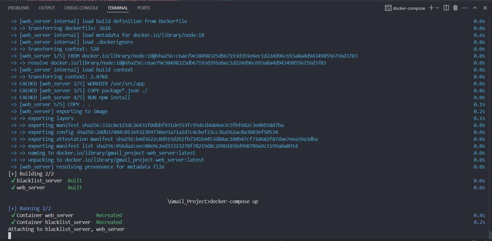

# Exercise 4 - Gmail-like React Web Application
This project implements a complete Gmail-like web application using React that communicates with the web server from Exercise 3. The application provides a modern, responsive interface inspired by Gmail's design and functionality.

---

## Project Overview

This is a full-stack Gmail clone consisting of:

- **Frontend**: React application with modern UI/UX
- **Backend**: Multi-threaded web server (from Exercise 3)
- **URL Filtering**: Blacklist server integration (from Exercise 2)

The React application provides all the functionality of Gmail including user authentication, email management, search capabilities, and theme switching.

---

## Features

### Authentication & User Management

- **User Registration**: Complete registration form with profile image upload
- **User Login**:  Secure authentication with JWT tokens
- **Form Validation**: Client-side validation for all input fields
- **Session Management**: Automatic session handling and route protection

### Email Management

- **Inbox View**: Display emails with Gmail-like interface
- **Compose Email**: Rich email composition with real-time validation
- **Draft Management**: Save and edit email drafts
- **Email Actions**: Reply, forward, delete emails
- **Search Functionality**: Advanced email search with real-time results

### Organization & Labels

- **Custom Labels**: Create, edit, and manage email labels
- **Email Categorization**: Organize emails with labels
- **Folder Navigation**: Inbox, Sent, Drafts, Spam filtering

### User Experience

- **Dark/Light Theme**: Toggle between themes with persistent settings
- **Responsive Design**: Mobile-friendly responsive layout
- **Gmail-inspired UI**: Authentic Gmail look and feel
- **Real-time Update**s: Live email updates across browser tabs

---

## Requirements

- Docker & Docker Compose
- Node.js (for development)
- Modern web browser

## Getting Started

### Building and Running with Docker

Build the Docker image + Start both servers:
```bash
docker-compose up --build
```

This will start:

1. URL Blacklist Server
2. Gmail Web Server
3. React Application (served by web server)

### Access the application

```
http://localhost:8080
```

To stop all running containers:
```bash
docker-compose down
```

Example of a successful build + launch of the servers:



---

## Application Functionality

### User Authentication & Registration

#### Registration Process

- **User Registration Form**: New users can register with full name, email, password, confirm password, birth date, and profile image (not required)
- **Form Validation**: All fields are required with specific validation rules:

  - Password must be at least 8 characters with uppercase letters and digits
  - Email format validation and uniqueness check
  - Birth date validation (must be 13+ years old)
  - Profile image upload with file validation

- Visual Feedback: Clear error messages and validation indicators for invalid inputs

#### Login Process

- **Login Form**: Existing users login with email and password
- **JWT Authentication**: Upon successful login, users receive a JWT token for session management
- **Session Persistence**: Authentication state maintained across browser sessions
- **Automatic Redirect**: Successful login redirects to main inbox interface

#### Route Protection

- **Protected Routes**: Main application screens require authentication (inbox, compose, settings)
- **Public Routes**: Login and registration accessible without authentication
- **Auto-redirect**: Unauthenticated users automatically redirected to login when accessing protected content

### Email Management System

#### Inbox & Email Display

- **Inbox View**: Gmail-like interface displaying all received emails
- **Email List**: Shows sender, subject, date, and read/unread status
- **Email Details**: Click any email to view full content with sender details, subject, body, and timestamps
- **Real-time Updates**: New emails appear automatically without page refresh

#### Email Composition & Sending

- **Compose Interface**: Rich email editor with recipient, subject, and body fields
- **Draft Management**:
  - Save emails as drafts without sending
  - Edit existing drafts and send later
  - Drafts automatically saved during composition
- **Send Functionality**:
  - Send emails with URL validation through blacklist server
  - Emails with blacklisted URLs are Will go to spam
  - Successful sends show confirmation and update sent folder

#### Email Actions & Management

- **Delete Emails**: Remove emails from inbox (soft delete - only removes for current user)
- **Email Search**:
  - Search through all emails by content, sender, or subject
  - Real-time search results as you type
  - Search across inbox, sent, and draft folders

### Labels System

- **Create Labels**: Add custom labels for email organization
- **Edit Labels**: Rename existing labels
- **Delete Labels**: Remove labels (emails remain, just lose the label)
- **Apply Labels**: Assign labels to emails for categorization

#### Organization System

- **Inbox**: All received emails
- **Sent**: Emails you've sent to others
- **Drafts**: Unsent email drafts
- **Spam**: Filtered emails (through blacklist system)
- **Custom Labels**: Navigate emails by custom labels

### User Interface & Experience

- **Dark/Light Mode Toggle**: Switch between themes via header button
- **Theme Persistence**: Selected theme saved and restored on app reload
- **Gmail-inspired Design**: Authentic Gmail look and feel in both themes
- **Collapse sidebar**: Left navigation collapses on click

### Real-time Features

- **Cross-tab Synchronization**: Changes in one browser tab reflect in others
- **Automatic Refresh**: New emails appear without manual refresh
- **Dynamic UI Updates**: Interface updates immediately after actions (send, delete, etc.)
- **Clear Error Messages**: Specific error messages for various failure scenarios
- **Loading States**: Visual indicators during server communication
- **Success Confirmations**: Positive feedback for successful actions

---

## API Integration

The React app communicates with the Exercise 3 server:

### Authentication Endpoints

```
POST /api/users        // User registration
POST /api/tokens       // User login
GET /api/users/:id     // User profile
```

### Email Management

```
GET /api/mails                    // Get inbox
POST /api/mails                   // Send/save email
GET /api/mails/:id               // Get specific email
PATCH /api/mails/:id             // Update draft
DELETE /api/mails/:id            // Delete email
GET /api/mails/search/:query     // Search emails
```

### Label Management

```
GET /api/labels        // Get all labels
POST /api/labels       // Create label
PATCH /api/labels/:id  // Update label
DELETE /api/labels/:id // Delete label
```

---

## Screenshots 

### Registration Page


### Login Page


### Main Screen


### Email Composition


### Dark Theme


---

## Data Persistence

This server uses in-memory storage. All data (users, emails, labels, drafts) is lost when the server restarts.

The blacklist server maintains its own persistence for URL validation.
