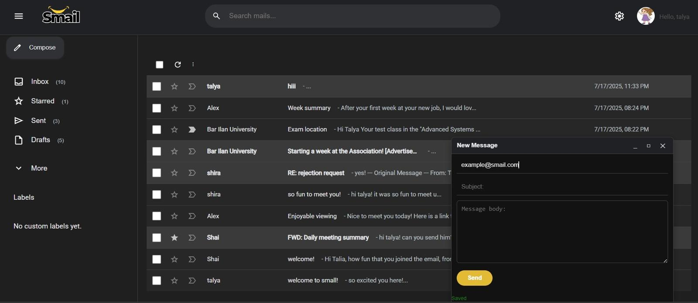
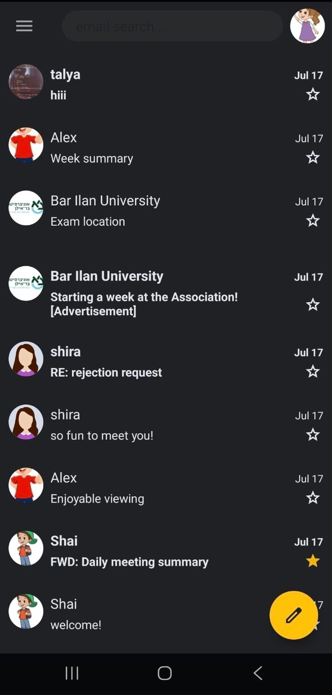

# Smail - Gmail-Like Email System

This project is a full-featured Gmail-like system, including both a modern **React web client**, a native **Android application**, and a custom **Node.js backend** server with URL blacklist integration. The system supports full email management, user authentication, search, labeling, spam filtering, and real-time synchronization.


---

## System Overview

The system consists of the following components:

- **React Web Client**: A responsive, Gmail-styled frontend application with full user interaction and dynamic updates.
- **Android Mobile Application**: A native Android app implementing similar functionality for mobile users.
- **Node.js Backend Server**: RESTful API server managing users, emails, labels, and authentication.
- **MongoDB Database**: Persistent storage for all system entities.
- **Blacklist Microservice**: A standalone URL filtering server that detects and redirects suspicious emails to spam.
- **Dockerized Environment**: All services are orchestrated via Docker and Docker Compose for seamless deployment.

---

## Features

### User Management

- User registration with full form validation
- Profile picture upload (optional)
- Secure login with JWT token-based authentication
- Persistent session handling across reloads and sessions
- Route protection for all authenticated-only views

### Email Management

- Compose, send, and save email drafts
- View full inbox, sent mail, drafts, and spam
- Reply to and forward emails
- Auto-save drafts during composition
- Soft-delete emails (user-level)
- Blacklisted URLs trigger spam redirection

### Label System

- Create, edit, delete, and assign custom labels to emails
- Navigate emails by label

### Search & Organization

- Real-time search by sender, subject, or content
- Organize emails into folders: Inbox, Sent, Drafts, Spam, important, starred, trash and more

### User Experience

- Fully responsive design (desktop and mobile)
- Light/Dark theme support with preference persistence
- Real-time updates across browser tabs (cross-tab sync)
- Clear validation errors, confirmation messages, and loading states
- Collapsible sidebar navigation

---

## Architecture and Technologies

| Component           | Technology Stack                          |
|---------------------|-------------------------------------------|
| Web Frontend        | React, Axios, JWT, CSS Modules            |
| Android App         | Java, MVVM, Room, Retrofit                |
| Backend API Server  | Node.js, Express, MongoDB, Mongoose       |
| URL Filter Service  | C++, Persistent In-memory DB              |
| Deployment          | Docker, Docker Compose                    |

---

## Setup and Installation

### Prerequisites

- Docker & Docker Compose
- Git
- Android Studio (optional, for Android app)

### Clone and Run

```bash
git clone https://github.com/TalyaCohen1/Gmail_Project.git
cd Gmail_Project
docker-compose up --build
```

Services started:

- Backend API: http://localhost:3000
- Web Client: http://localhost:8080
- Blacklist Server: http://localhost:12345

To stop services:

```bash
docker-compose down
```

### Android Configuration

To run the Android app, update the following:

- In `local.properties`: set `backend_ip` to either `10.0.2.2` (emulator) or local IP (device).
- In `network_security_config.xml`: add your backend IP for HTTP access.
- Open the app in Android Studio, sync Gradle, and run.

---

## API Overview

### Authentication

```
POST   /api/users          - Register new user
POST   /api/tokens         - Login and receive JWT
GET    /api/users/:id      - Retrieve user info
```

### Emails

```
GET    /api/mails                  - Get inbox
POST   /api/mails                  - Send or save email
GET    /api/mails/:id              - Get email by ID
PATCH  /api/mails/:id              - Update draft
DELETE /api/mails/:id              - Delete email
GET    /api/mails/search/:query    - Search emails
```

### Labels

```
GET    /api/labels                - Retrieve labels
POST   /api/labels                - Create new label
PATCH  /api/labels/:id            - Edit label
DELETE /api/labels/:id            - Remove label
```

---

## Folder Structure

```
📦 gmail-project
 ┣ 📂 backend_server/      # Node.js API Server
 ┣ 📂 blacklist-server/    # URL filtering service
 ┣ 📂 web_client/          # React app
 ┣ 📂 android_app/         # Android Studio app
 ┣ 📂 docker/              # Docker files for each part
 ┣ 📜 docker-compose.yml   # Docker multi-service configuration
 ┣ 📜 README.md            # Main project overview
```

---

## Dark Mode

The following images demonstrate the application's dark mode interface on both web and Android, highlighting visual consistency and user-friendly design across platforms.

### Web Client

<p align="center">
  
</p>

### Android App

<p align="center">
  
</p>

---

## Demo Videos

To see live demonstrations of the system in action:

### Web Client
- Registration & Login Flow  
- Inbox, Mail View, Compose & Drafts
- Mark mail as Spam & Important

https://github.com/user-attachments/assets/5c786bff-8daa-4169-8f4e-1d90c46807dc

### Android App
- App Launch, registration & Login  
- Viewing & Sending Emails  
 
https://github.com/user-attachments/assets/f0324833-d6d1-4557-8b61-9c5dba1fa3f0

---

## Documentation

Detailed usage guides can be found in the project's [Wiki](https://github.com/TalyaCohen1/Gmail_Project/tree/main/wiki), including:

- [Environment Setup](wiki/1-Setup-and-Run.md)
- [Register & Login Flow](wiki/2-Register-and-Login.md)
- [Email Actions](wiki/3-Email-Actions.md)

---

## Acknowledgments

- Inspired by Gmail's design and functionality
- Built as part of advanced programing course
