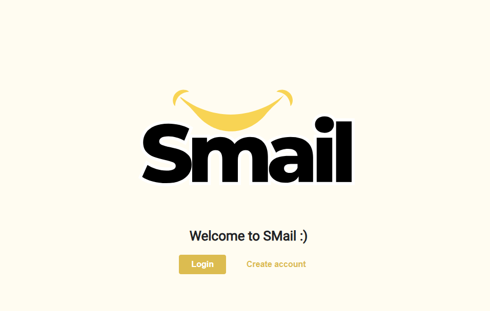

# 📧 Smail - Gmail Clone Project

A full-stack email application built with React, Node.js, MongoDB, and Android, featuring a complete email management system with modern UI/UX.



## Features

### Core Email Features
- **Send & Receive** emails with rich text support
- **Folder Management** (Inbox, Sent, Drafts, Trash, Spam)
- **Custom Labels** with the ability to edit
- **Star/Important** email marking
- **spam system** that manages malicious URLs with Bloomfilter
- **Advanced Search** by query
- **Reply & Forward** functionality
- **Draft Management** with auto-save

### Multi-Platform Support
- 🌐 **Web Client** - Responsive React application
- 📱 **Android Client** - Native Android app
- 🔄 **Real-time Sync** between platforms

### User Management
- 👤 **User Registration** with profile pictures
- 🔐 **JWT Authentication** 
- 🖼️ **Profile Management**
- 🔒 **Secure Password Hashing**

## Architecture 

```
📦 Gmail_Project/
├── frontend/          # React web client
├── backend/           # Node.js API server
├── blacklist_server/  # c++ server for spam emails
├── android_app/       # Android application
├── docker-compose.yml # Multi-container setup
├── wiki/              # Documentation
└── README.md          # This file
```

### Technology Stack

**Frontend (Web):**
- React.js
- Material-UI / Custom CSS
- Axios for API calls
- JWT authentication

**Backend:**
- Node.js with Express
- MongoDB with Mongoose
- JWT tokens
- Multer for file uploads

**Android:**
- Java
- Retrofit for API calls
- SharedPreferences for storage

**Infrastructure:**
- Docker & Docker Compose
- MongoDB database
- RESTful API design

## UI/UX Features

- **Responsive Design** for all screen sizes
- **Dark/Light Mode** support
- **Intuitive Navigation** with sidebar
- **Real-time Updates** 

## Acknowledgments

- Inspired by Gmail's design and functionality
- Built as part of advanced programing course
