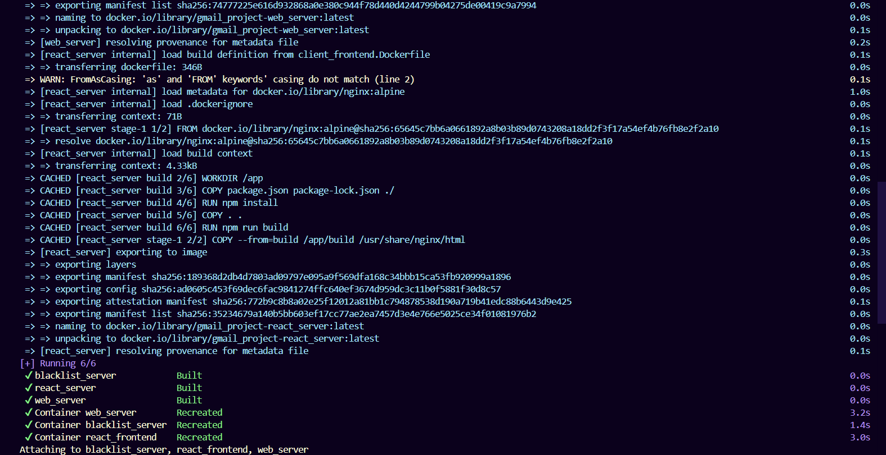

# Part B - URL Blacklist Filter (Client-Server Version)
This project extends the original URL Blacklist Filter by implementing a client-server architecture using TCP communication.

The server is implemented in C++ and the client in Python. Communication is handled over a single persistent TCP socket.

---

## Description
The URL Blacklist Filter allows you to:

1. Add URLs to a blacklist
2. Check if a URL is potentially in the blacklist
3. Delete a URL from the blacklist

It uses a Bloom filter for fast membership testing with a small memory footprint, while maintaining a full list for verification.

## Requirements

- Docker
- Docker Compose

## Getting Started
## Building and Running with Docker

Build the Docker image:
```
docker-compose build
```

To upload the server in one terminal:
```
docker-compose up server
```

Run the client in another terminal:
```
docker-compose run --rm client
```

To stop all running containers:
```
docker-compose down
```
Example of how the build looks:



## Usage
## Initial Configuration
When you first run the program, you need to provide configuration parameters to the server and client.
1. For the server the parameters are:
```
<port number> <size> <hash1> <hash2> ... <hashN>
```
Where:

- `<port number>` is the port number we want the server to run on
- `<size>` is the size of the Bloom filter
- `<hash1> <hash2> ... <hashN>` are the number of times each hash function should be applied

the configuration parameters to the server will be entered in the `command` line in server section in the `docker-compose.yml` file as follows:


In this example, the parameters entered are:
```
5555 100 1 2 3
```
This creates a server on port number 5555, that creates a Bloom filter of size 100, applying hash function 1 once, hash function 2 twice, and hash function 3 three times.

2. For the client the parameters are:
```
<IP> <port number> 
```
where:

- `<IP>` is the IP number of the server
- `<port number>` is the port number that the server is running on

the configuration parameters to the server will be entered in the `command` line in the client section in the `docker-compose.yml` file as follows:


In this example, the parameters entered are:
```
server 5555
```
this gives the client th IP of the server and the port number 5555, which is the same port number that the server got.

---

## Commands
The program accepts three types of commands:

1. Add a URL to the blacklist:
```
POST <url>
```

2. Check if a URL is in the blacklist:
```
GET <url>
```

3. Delete a url from the blacklist (doesn't change the bloomfilter):
```
DELETE <url>
```

## Command Outputs

- For command `POST` (Add URL): the output that is displayed after adding a URL is '201 Created'
- For command `GET` (Check URL): the output that is displayed is '200 Ok' followed by one of three possible outputs (with 1 empty line separating):
  - `true true` - The URL is definitely in the blacklist (found in both Bloom filter and actual blacklist)
  - `true false` - A false positive from the Bloom filter (URL appears to be in the Bloom filter but isn't in the actual blacklist)
  - `false` - The URL is definitely not in the blacklist
- For command `DELETE`: the output that is displayed is '204 No Content'.
- For logically wrong commands (like tring to delete a URL that is not in the blacklist): the output will be '404 Not Found'.
- For invalid command: the output will be '400 Bad Request'.

## Stopping The Program
To stop the program, press `ctrl + C` or `quit`.
The program will save all blacklisted URLs to the data file. When you restart the container, it will load the previously saved blacklist from the persistent volume.

## Running Example
This is an example of the inputs and outputs of the program:


## Data Persistence
All blacklisted URLs are stored in a file at `data/urlblacklist.txt`. The Docker volume ensures this data persists between container restarts.

---

## Development
Project Structure

- `src/`: Source code files
- `tests/`: Test files
- `CMakeLists.txt`: CMake configuration
- `client.Dockerfile`, `server.Dockerfile`, `tests.Dockerfile`, `docker-compose.yml`: Docker build configuration
- `screenshots/`: the images used in this file

---

## Testing
after the build command, which is:
```
docker-compose build
```

the command for running the tests:
```
docker-compose run --rm tests
```

by running those command, the output should be like this:


---

## Answers to the questions in the task:
- Did we need to modify closed code to add a new command?
No. We used the `ICommand` pattern, so to add a new command, we only had to create a new class that implements the `ICommand` interface and provides an `execute` method with the same signature.
We also added a delete function to the `BloomFilter` class, which did not affect the rest of the class. Additionally, we added an option for the `DELETE` command (resulting in three options for `execute`).

- Did we need to modify closed code to change the names of the commands?
No. We only changed the class names (e.g., from `Add` to `Post` and from `Check` to `Get`). In the `ConfigParser` class, instead of checking command numbers, we extracted the first word of the input as the command. This change did not affect the rest of the code, and the modified part was necessary.

- Did we need to modify closed code to change the output of the commands?
No. We only needed to change the content of the output. For example, instead of printing `False` with `cout << "False"`, we changed it to `cout << "200 OK\n\n" << "False"`.
Since the output was handled inside the command classes, we didn’t need to modify any other parts of the code — just the `execute` method in each command class.

- Did we need to modify closed code to change the I/O sources?
No. Instead of writing output directly to `cout` inside the `execute` functions, we changed those functions to return a `string`. Then, the server handled the actual output.
As for the input, instead of reading from the terminal, we received input from the client via the server, and parsing the input string remained the same.

---
