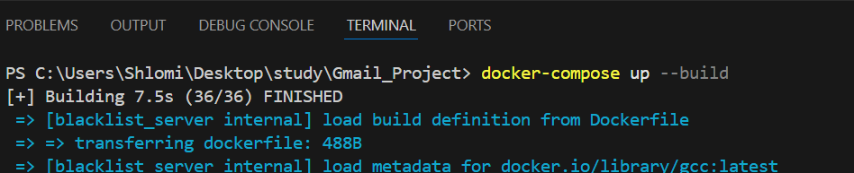
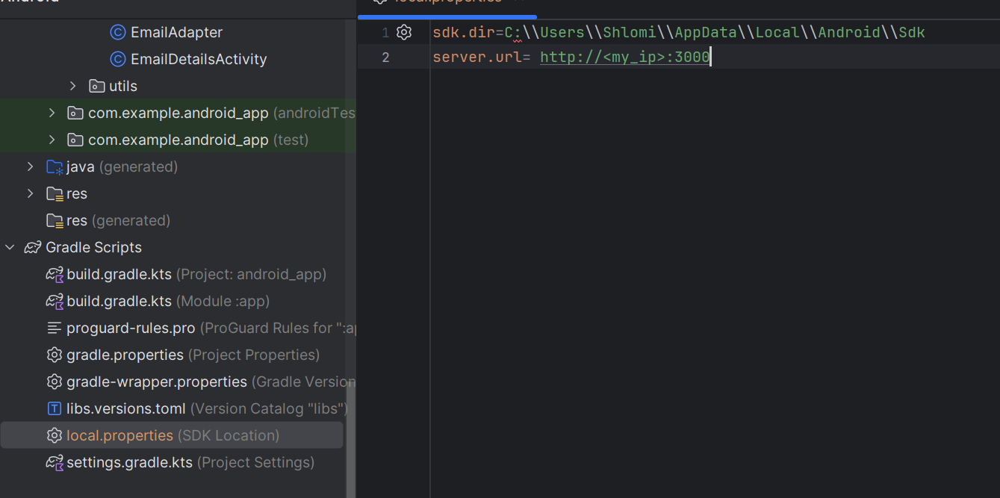
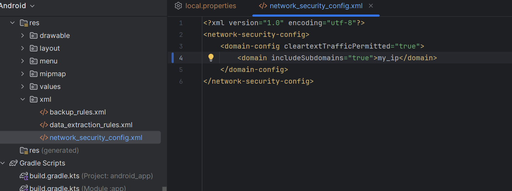

# 📦 Full Environment Setup & Run Guide

This guide explains how to set up and run the entire project using Docker and `docker-compose`, including instructions for configuring the Android application.

---

## 📁 Prerequisites

Before running the system, make sure the following tools are installed:

- [✔️ Docker](https://docs.docker.com/get-docker/)
- [✔️ Docker Compose](https://docs.docker.com/compose/install/)
- [✔️ Git](https://git-scm.com/)
- [✔️ Android Studio](https://developer.android.com/studio) (if running the Android app)


---

## Step 1: Clone the Project

Open a terminal and run the following:

```bash
git clone https://github.com/TalyaCohen1/Gmail_Project.git
cd Gmail_Project
```

---

## Step 2: Start the System with Docker Compose

From the root directory, run:

```bash
docker-compose up --build
```

This will build and start the following services:

- Node.js backend (port **3000**)
- MongoDB database
- React frontend (port **8080**)

To stop the services:

```bash
docker-compose down
```



Access the system via:

- Frontend: [http://localhost:8080](http://localhost:8080)
- Backend API: [http://localhost:3000/api](http://localhost:3000/api)

---

## Step 3: Android Configuration

If you're working with the Android app, make sure to configure the IP address properly.

---

### 🔧 1. Update `local.properties`

Open the file:

```
android_app/local.properties
```

If you're using an **emulator**, use the special Android IP:

```properties
backend_ip=10.0.2.2
```

If you're using a **real device**, replace the above IP with your computer's local IP address (e.g., `192.168.1.102`).



---

### 🔐 2. Update `network_security_config.xml`

Navigate to:

```
android_app/app/src/main/res/xml/network_security_config.xml
```

add your ip adress in thus way:

```xml
   <domain includeSubdomains="true"><your_ip></domain>
```

> 💡 This allows HTTP communication for development when using IPs like `10.0.2.2`.



---

## 📲 Step 4: Run the Android App

1. Open the `android_app` folder in Android Studio.
2. Wait for Gradle sync to complete.
3. Make sure an emulator or physical device is running.
4. Click ▶️ to build and run the app.

---

## ✅ Summary

| Step | Description |
|------|-------------|
| 1    | Cloned the repository |
| 2    | Launched backend & frontend using Docker |
| 3    | Configured Android IP and security settings |
| 4    | Ran the Android app in emulator or device |

---

Now you ready to use Smail!