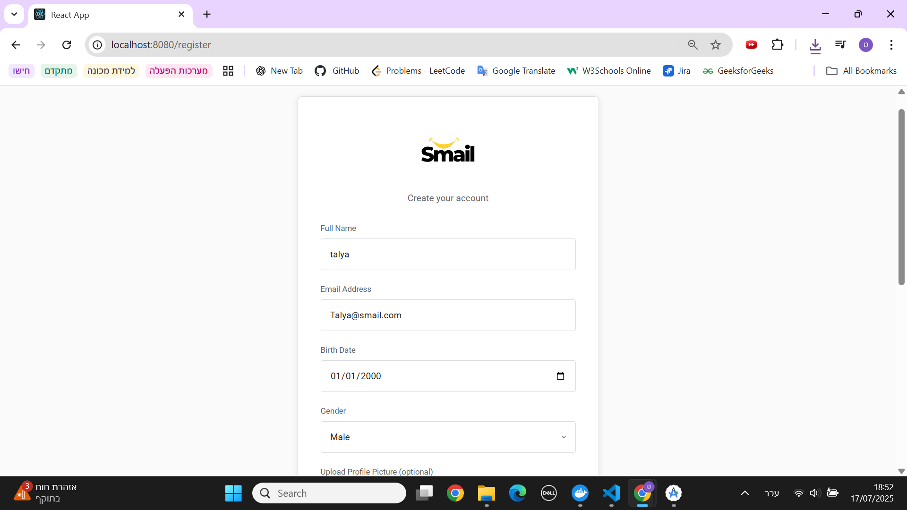
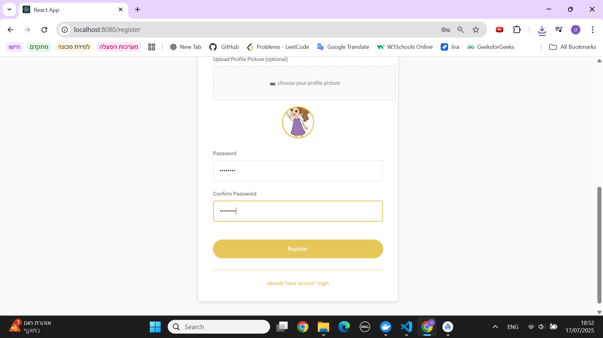
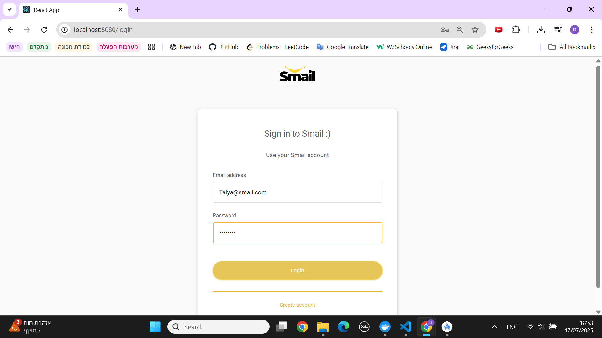
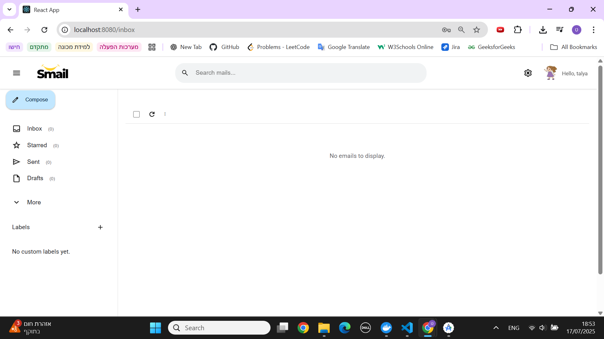
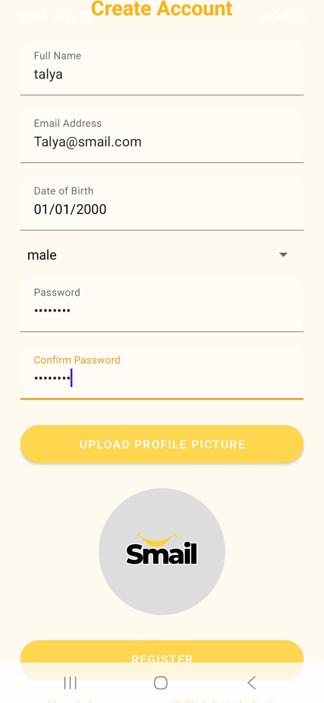
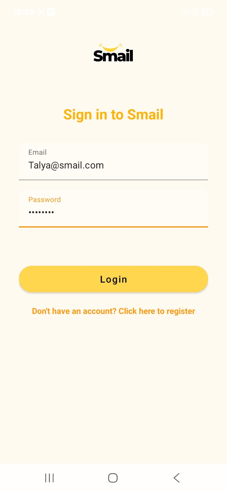
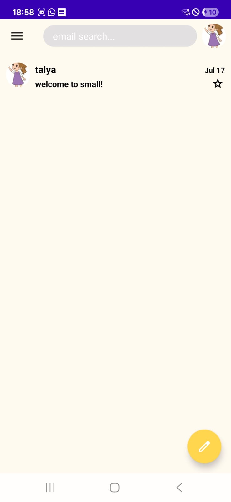
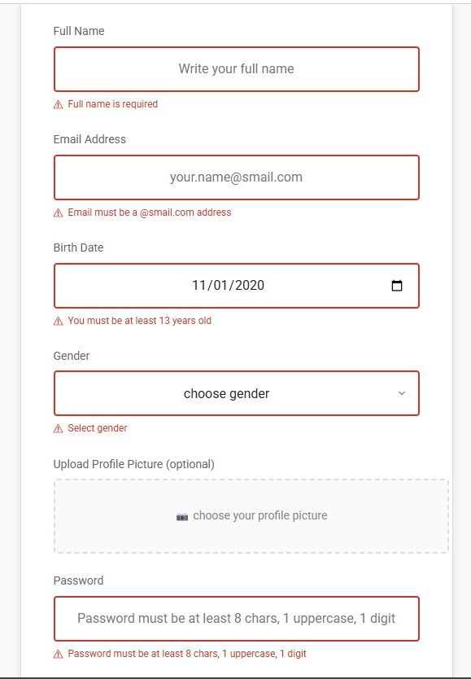
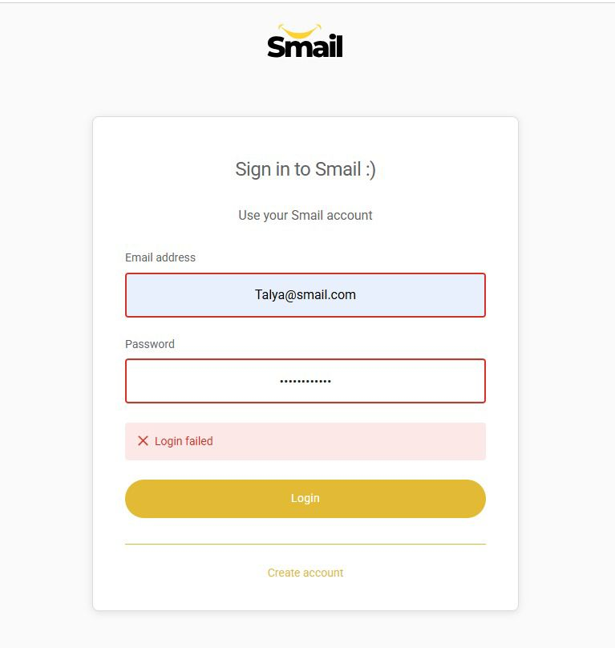

# 📝 Registration & Login

This page explains how users register and login to the system, both on the Web client and Android client.

---

## 🌐 Web Client

### 1. Registration

- On the login page, click the `Create Account` button.
- Fill out all required fields (you can also add aprofile picture).
- Click the `Register` button.
- After successful registration, you will be redirected to the login page.

    
    

    

### 2. Login

- Enter your email and password.
- Click the `Log in` button.
- If login is successful, you will be redirected to the inbox page.

    
    

    

---

## 📱 Android Client

### 1. Registration

- On the login screen, tap the `Create Account` button.
- Fill out all required fields (profile picture is optional).
- Tap the `Register` button.
- After successful registration, you will be redirected to the login screen.

    

### 2. Login

- Enter your email and password.
- Tap the `Log in` button.
- If login is successful, you will be redirected to the inbox screen.

    
    

 

---

## ❗ Error Handling & Validation

### Registration Errors (Web)

- All required fields are validated before submission.
- Passwords must include at least 8 characters, one uppercase letter, and one number.
- Users are informed if an email is already registered or if any fields are invalid.

    

### Login Errors (Web)

- If login credentials are incorrect, an error message is displayed clearly to the user.

    

> All validation is handled both on the client-side and server-side to ensure data integrity and user experience.

---

## ⚙️ Technical Details (Optional)

- Registration sends a POST request to `/api/users` with user details (including multipart/form-data for profile image).
- Login sends a POST request to `/api/tokens` with email and password.
- On success, login returns a JWT token and user info, saved in local storage (Web) or SharedPreferences (Android).
- Basic input validation is performed on the client side.

---
