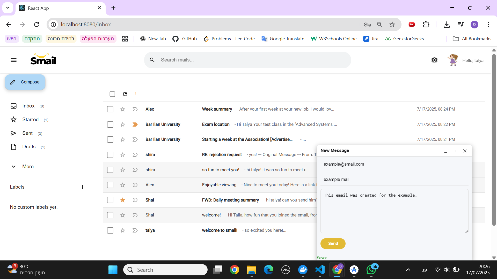
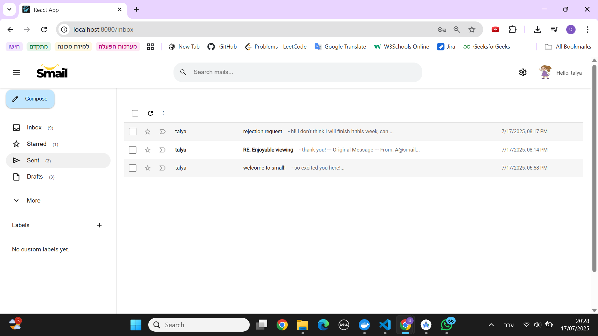
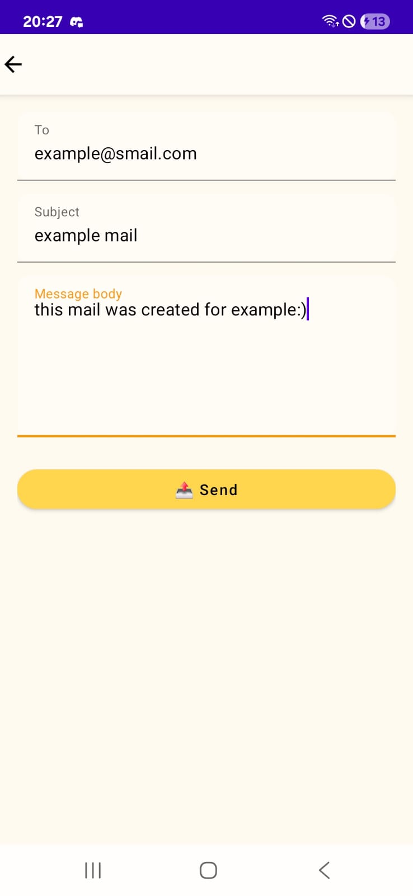
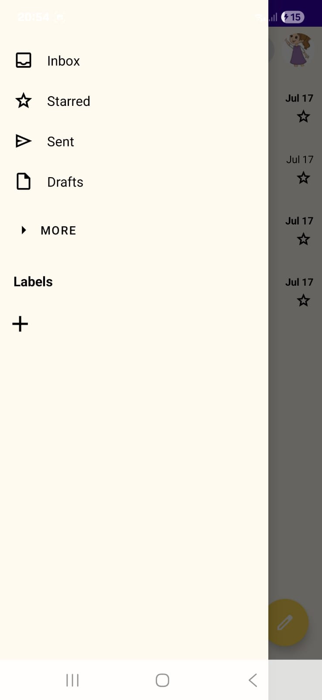
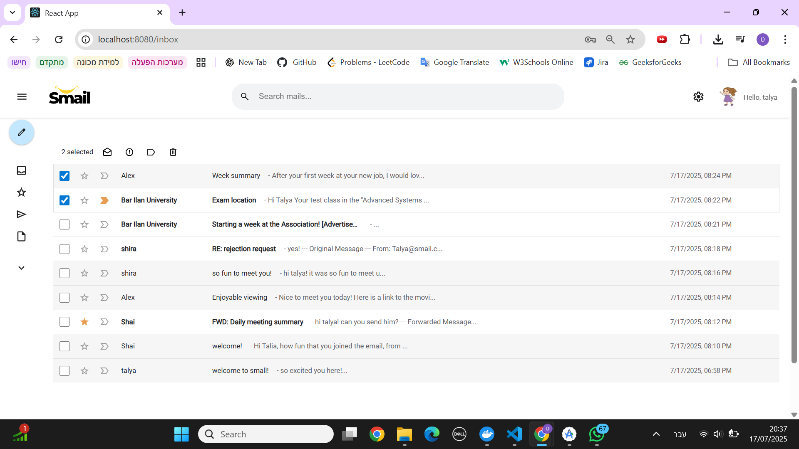
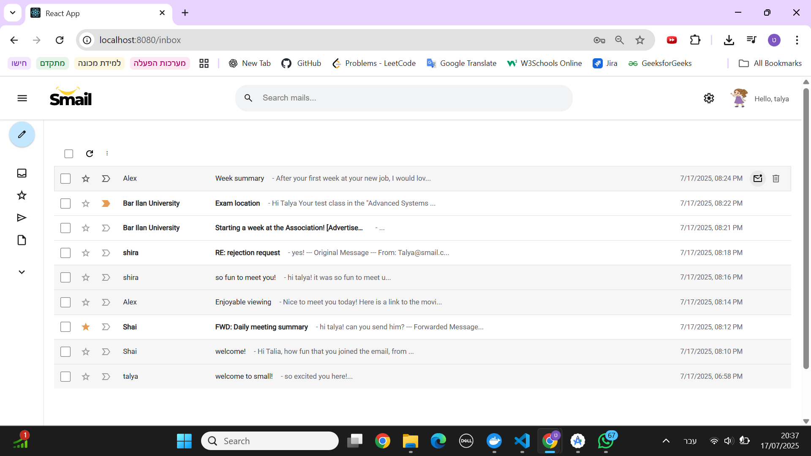
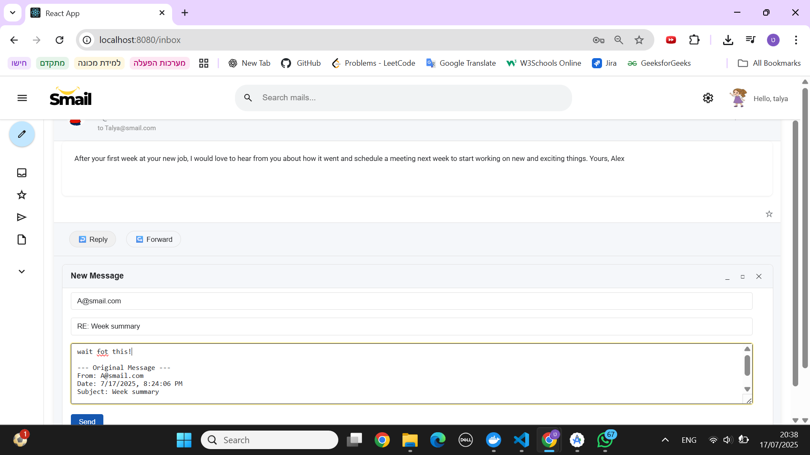
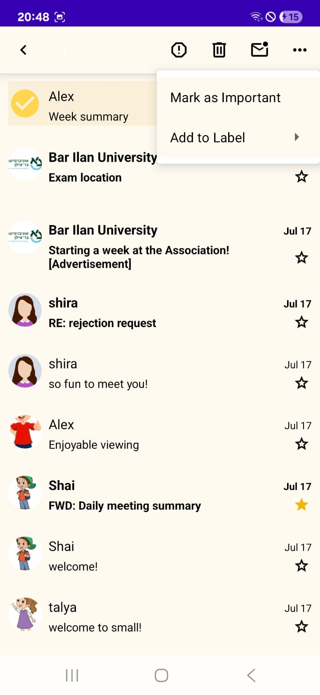
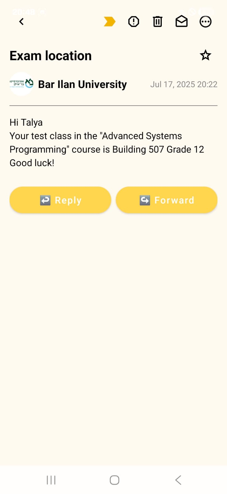
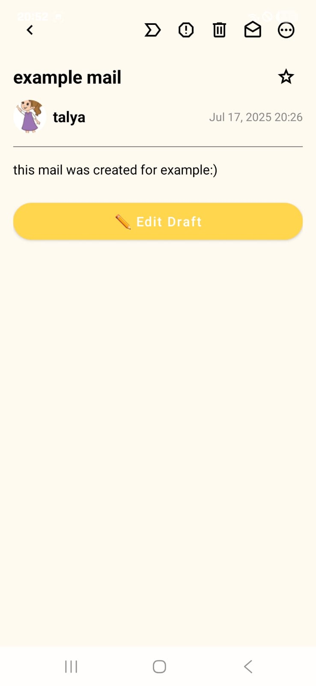

# 📬 Mail Operations

---

## ✉️ Send New Mail

### 🌐 Web Client

1. Click the **"Compose"** button in the sidebar.
2. Fill in the following fields:
   - **To**: Recipient email(s), e.g., `username@smail.com`
   - **Subject**: Subject of the message
   - **Body**: The message content
3. Click:
   - **X buttun** to save without sending
   - **"Send"** to send the email

   

➡️ Sent mails appear in the **Sent** folder.  

   

---

### 📱 Android Client

1. Tap the **"Compose"** (✏️) button.
2. Fill in:
   - **To**: Recipients, e.g., `username@smail.com`
   - **Subject**
   - **Body**
3. Tap:
   - **<- Buttun>** to save draft
   - **Send icon** 📤 to send

➡️ Sent mails appear in the **Sent** tab.  

    
    

 

---

## 🛠️ Edit Mails

### 🌐 Web Client

You can edit or manage emails from the **mail list**

By **hovering over a message**, you can choose to mark the message as unread or delete it from the list.

By **clicking on the message selection mark**, you can choose to assign to a label, mark as read/unread, report as spam or delete.

In addition, next to the email you can choose to quickly mark as important or star it

  
  

  

#### From the Mail View:
You can star the message and choose to reply or forward the message.
If you are viewing a draft, you can choose to edit the draft and save changes or send it.
  

  

---

### 📱 Android Client

#### From the Inbox:
Long-press an email.
Now you can do this actions:
   - 🗑️ Delete
   - 📩 Mark as read/unread
   - 🚫 Move to spam
   - ! Mark as important
   - 🏷️ Add/change labels

#### From the Mail View:
- Tap an email to open it.
- Use top icons to:
  -⭐ Mark or unmark the mail with a star (important).
  -🏷️ Mark the mail as important.
  -🗑️ Delete the mail.
  -🚫 Mark the mail as spam.
  -📩 Mark the mail as read/unread.
  -⚙️ Tap the three-dot menu for additional actions, including assigning labels.

-At the bottom of the mail view, you can:
↪️ Forward the mail.
💬 Reply to the mail.
✏️ If the mail is a draft, edit it and send.

    
    

 

---

## ⭐ Additional Mail Actions

Both clients support additional mail operations:

- 🔁 **Reply** to sender
- 🔀 **Forward** mail
- ⭐ **Mark as Important** or add star
- 🚫 **Move to Spam**
- 📁 **Move to Lable**
- 🏷️ **Add/Edit Labels**
- ✏️ **Edit draft**
- 🗑️ **Delete Mail**
- 📩 **Mark as read/unread**
- 🔎 **View Deleted Mails** in the Trash folder
- ✏️ **Edit user information**

---
