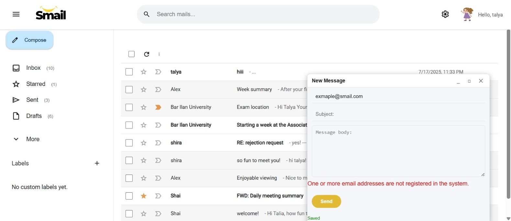

# 📬 Mail Operations

---

## ✉️ Send New Mail

### 🌐 Web Client

1. Click the **"Compose"** button in the sidebar.
2. Fill in the following fields:
   - **To**: Recipient email(s), e.g., `username@smail.com`
   - **Subject**: Subject of the message
   - **Body**: The message content
3. Click:
   - **X buttun** to save without sending
   - **"Send"** to send the email

   

➡️ Sent mails appear in the **Sent** folder.  

   

---

### 📱 Android Client

1. Tap the **"Compose"** (✏️) button.
2. Fill in:
   - **To**: Recipients, e.g., `username@smail.com`
   - **Subject**
   - **Body**
3. Tap:
   - **<- Buttun>** to save draft
   - **Send icon** 📤 to send

➡️ Sent mails appear in the **Sent** tab.  

    
    

 

---

## 🛠️ Edit Mails

### 🌐 Web Client

You can edit or manage emails from the **mail list**

By **hovering over a message**, you can choose to mark the message as unread or delete it from the list.

By **clicking on the message selection mark**, you can choose to assign to a label, mark as read/unread, report as spam or delete.

In addition, next to the email you can choose to quickly mark as important or star it

  
  

  

#### From the Mail View:
You can star the message and choose to reply or forward the message.
If you are viewing a draft, you can choose to edit the draft and save changes or send it.
  

  

---

### 📱 Android Client

#### From the Inbox:
Long-press an email.
Now you can do this actions:
   - 🗑️ Delete
   - 📩 Mark as read/unread
   - 🚫 Move to spam
   - ! Mark as important
   - 🏷️ Add/change labels

   

 

#### From the Mail View:
- Tap an email to open it.
- Use top icons to:
  -⭐ Mark or unmark the mail with a star (important).
  -🏷️ Mark the mail as important.
  -🗑️ Delete the mail.
  -🚫 Mark the mail as spam.
  -📩 Mark the mail as read/unread.
  -⚙️ Tap the three-dot menu for additional actions, including assigning labels.

-At the bottom of the mail view, you can:
↪️ Forward the mail.
💬 Reply to the mail.
✏️ If the mail is a draft, edit it and send.

    
    

 

---

## ❗ Error Handling – Sending to Non-Existing Recipient

If a user attempts to send an email to an address that does not exist in the system, an error message is displayed clearly below the recipient field or in a popup.

    

The system performs backend verification before sending. Invalid recipients are not accepted, and the message is not sent.

> The system ensures that emails are only sent to valid, existing users. No messages are lost or sent to unknown addresses.

---

## 🧹 Additional Behavior Details

### 🗑️ Soft Delete
When a user deletes an email, it is removed only from their personal inbox or sent folder, but not from the system entirely. This "soft delete" ensures that The email remains accessible to the user through the Trash folder.

### 🚫 Spam Detection & Blacklist Filtering

When a user marks an email as spam, the system scans the content of the message for any embedded URLs. These URLs are then:

- Sent to a **dedicated Blacklist Server** that uses a **Bloom Filter** to efficiently store and check URL existence.
- Saved in a **local persistent file** on the Blacklist Server for future sessions.

From that point on, **any incoming email** that contains one or more of those blacklisted URLs will be automatically classified as spam and redirected to the **Spam folder**, without reaching the main inbox.

> This mechanism ensures real-time spam filtering based on crowd-sourced reporting, without needing centralized database lookups.

---

## ⭐ Additional Mail Actions

Both clients support additional mail operations:

- 🔁 **Reply** to sender
- 🔀 **Forward** mail
- ⭐ **Mark as Important** or add star
- 🚫 **Move to Spam**
- 📁 **Move to Lable**
- 🏷️ **Add/Edit Labels**
- ✏️ **Edit draft**
- 🗑️ **Delete Mail**
- 📩 **Mark as read/unread**
- 🔎 **View Deleted Mails** in the Trash folder
- ✏️ **Edit user information**

---
